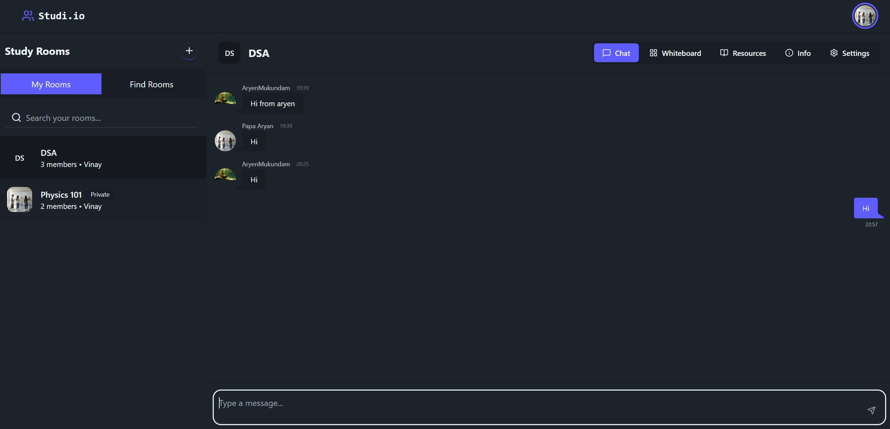

# 📚 Studi.io

[](https://github.com/yamiSukehiro2907/studi.io/stargazers)
[](https://github.com/yamiSukehiro2907/studi.io/issues)
[](https://github.com/yamiSukehiro2907/studi.io/network/members)

**Studi.io** is a modern, interactive web application for creating and joining virtual study rooms. It helps students connect, collaborate, and stay productive in a focused online environment.



---

## ✨ Features

- **🚪 Create & Join Rooms** – Easily create or join existing public study rooms.
- **🔒 Privacy Control** – Public or private rooms with a simple toggle.
- **🖼️ Room Customization** – Set a custom name, description, and avatar.
- **☁️ Cloud Image Uploads** – Room images hosted on [Cloudinary](https://cloudinary.com/).
- **⚙️ Room Management** – Edit room details anytime via an intuitive modal.
- **🔔 Real-time Notifications** – Feedback powered by [`react-hot-toast`](https://react-hot-toast.com/).
- **📱 Responsive Design** – Mobile-first interface using [Tailwind CSS](https://tailwindcss.com/)
- **🔐 Authentication** – Secure JWT-based login system.
- **📧 Email Service** – Notifications via Gmail using [SendGrid](https://sendgrid.com/en-us).
- **💬 Real-time Chat** – Text and eventually voice chat within rooms.

---

## 🚀 Upcoming Features

- **📝 Whiteboard** – Collaborative real-time note-taking.
- **🗂️ ResourceHub** – Upload and organize PDFs, links, and study materials.

---

## 💻 Tech Stack

| Category           | Technology                                                                                                                     |
| :----------------- | :----------------------------------------------------------------------------------------------------------------------------- |
| **Frontend**       | [React](https://reactjs.org/), [TypeScript](https://www.typescriptlang.org/), Tailwind CSS                                     |
| **State & UI**     | [React Router](https://reactrouter.com/), [Lucide Icons](https://lucide.dev/), [React Hot Toast](https://react-hot-toast.com/) |
| **Backend**        | [Node.js](https://nodejs.org/), [Express.js](https://expressjs.com/)                                                           |
| **Database**       | [MongoDB](https://www.mongodb.com/) with [Mongoose](https://mongoosejs.com/)                                                   |
| **Authentication** | JWT, bcrypt                                                                                                                    |
| **File Storage**   | [Cloudinary](https://cloudinary.com/)                                                                                          |
| **Email Service**  | [SendGrid](https://sendgrid.com/en-us)                                                                                         |

---

## 🛠️ Getting Started

### Prerequisites

- [Node.js](https://nodejs.org/) v18+
- npm or yarn
- [MongoDB Atlas](https://www.mongodb.com/) cluster
- [Cloudinary](https://cloudinary.com/) account
- SendGrid account with an [API KEY](https://sendgrid.com/en-us)
---

### Installation

1. **Clone the repository**

```bash
git clone https://github.com/yamiSukehiro2907/studi.io
cd studyhub
```

2. **Backend Dependencies**

```bash
cd server
npm install
```

3. **Frontend Dependencies**

```bash
cd ../client
npm install
```

---

### Environment Variables

**Backend (`server/.env`)**

```env
PORT=8000
CONNECTION_STRING=your_mongodb_connection_string
ACCESS_TOKEN_SECRET=your_access_token_secret
REFRESH_TOKEN_SECRET=your_refresh_token_secret
ACCESS_TOKEN_EXPIRATION=3600000
REFRESH_TOKEN_EXPIRATION=604800000
CLOUDINARY_CLOUD_NAME=your_cloud_name
CLOUDINARY_API_KEY=your_api_key
CLOUDINARY_API_SECRET=your_api_secret
EMAIL_USER=your_gmail@gmail.com
SENDGRID_API_KEY=your_sendgrid_api_key
NODE_ENV=production
```

**Frontend (`client/.env`)**

For Vite:

```env
VITE_API_BASE_URL=http://localhost:8000
```

---

### Running the App

**Backend**

```bash
cd server
npm run dev
```

**Frontend**

```bash
cd client
npm run dev
```

---

## 🤝 Contributing

Contributions are welcome! Please follow these steps:

1. Fork the repository.
2. Create a new branch: `git checkout -b feature/YourFeature`
3. Commit your changes: `git commit -m 'Add some feature'`
4. Push to the branch: `git push origin feature/YourFeature`
5. Open a pull request.

---

## 🔗 Links

- **GitHub Repository:** [Studi.io](https://github.com/yamiSukehiro2907/studi.io)
- **Project Demo:** [https://studiio.netlify.app](https://studiio.netlify.app)

---
