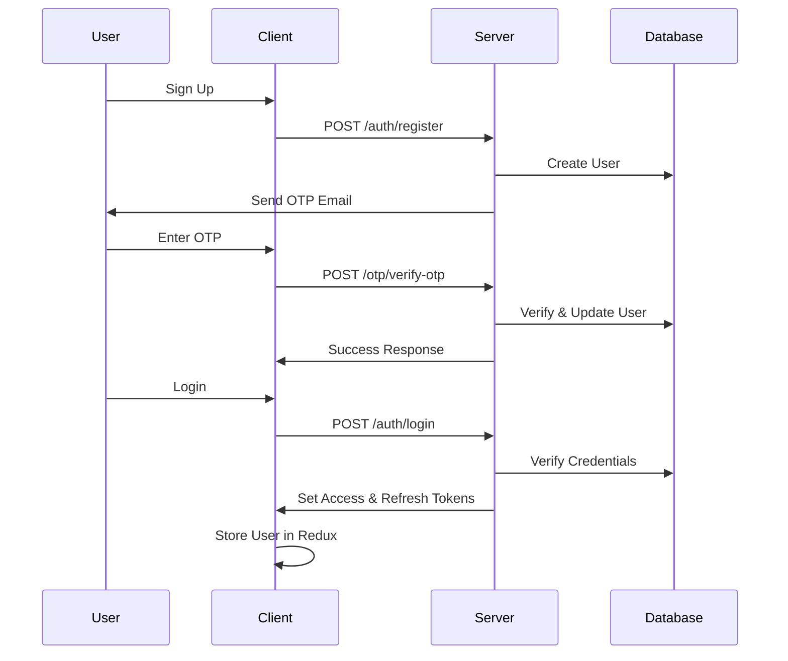

# 📚 Studi.io

[](https://github.com/yamiSukehiro2907/studi.io/stargazers)
[](https://github.com/yamiSukehiro2907/studi.io/issues)
[](https://github.com/yamiSukehiro2907/studi.io/network/members)

**Studi.io** is a modern, collaborative study platform that brings students together in virtual study rooms. Built with real-time communication, resource sharing, and interactive whiteboards, Studi.io makes group studying productive and engaging.


🔗 **Live Demo:** [https://studiio.netlify.app](https://studiio.netlify.app)

---

## ✨ Features

### 🎯 Core Features
- **🚪 Create & Join Rooms** – Easily create or join public/private study rooms
- **💬 Real-time Chat** – Instant messaging with Socket.IO for seamless communication
- **🔒 Privacy Control** – Public or private rooms with customizable access
- **🖼️ Room Customization** – Set custom names, descriptions, and avatars
- **☁️ Cloud Image Uploads** – Profile and room images hosted on Cloudinary
- **⚙️ Room Management** – Full CRUD operations for room owners and admins
- **👥 Member Management** – Admin controls and member permissions
- **🔔 Real-time Notifications** – Instant feedback with `react-hot-toast`
- **📱 Responsive Design** – Mobile-first UI with Tailwind CSS
- **🔐 Secure Authentication** – JWT-based auth with access/refresh tokens
- **📧 Email Service** – OTP verification and notifications via SendGrid

### 🚀 Upcoming Features
- **📝 Collaborative Whiteboard** – Real-time drawing and note-taking
- **🗂️ ResourceHub** – Centralized document and link management
- **🎥 Video Chat** – Built-in video conferencing
- **📊 Study Analytics** – Track study time and productivity
- **🔔 Push Notifications** – Browser push notifications for updates

---

## 💻 Tech Stack

### Frontend
| Technology | Purpose |
|-----------|---------|
| [React 18](https://reactjs.org/) | UI framework with hooks and modern features |
| [TypeScript](https://www.typescriptlang.org/) | Type-safe JavaScript |
| [Tailwind CSS](https://tailwindcss.com/) | Utility-first CSS framework |
| [Redux Toolkit](https://redux-toolkit.js.org/) | State management with Redux Persist |
| [React Router](https://reactrouter.com/) | Client-side routing |
| [Socket.IO Client](https://socket.io/) | Real-time WebSocket communication |
| [Axios](https://axios-http.com/) | HTTP client with interceptors |
| [Lucide React](https://lucide.dev/) | Beautiful icon library |
| [React Hot Toast](https://react-hot-toast.com/) | Toast notifications |
| [Vite](https://vitejs.dev/) | Lightning-fast build tool |

### Backend
| Technology | Purpose |
|-----------|---------|
| [Node.js](https://nodejs.org/) | JavaScript runtime |
| [Express.js](https://expressjs.com/) | Web framework |
| [MongoDB](https://www.mongodb.com/) | NoSQL database |
| [Mongoose](https://mongoosejs.com/) | MongoDB ODM with schemas |
| [Socket.IO](https://socket.io/) | Real-time bidirectional communication |
| [JWT](https://jwt.io/) | JSON Web Tokens for authentication |
| [bcrypt](https://www.npmjs.com/package/bcrypt) | Password hashing |
| [Cloudinary](https://cloudinary.com/) | Cloud-based image storage |
| [SendGrid](https://sendgrid.com/) | Email delivery service |
| [Multer](https://www.npmjs.com/package/multer) | File upload handling |

---

## 🏗️ Architecture

### System Design
```
┌─────────────┐         ┌──────────────┐         ┌─────────────┐
│   Client    │◄───────►│    Server    │◄───────►│   MongoDB   │
│  (React)    │  HTTP   │  (Express)   │  CRUD   │  (Database) │
└─────────────┘         └──────────────┘         └─────────────┘
       ▲                       ▲                         
       │                       │                         
       │    WebSocket          │                         
       └───────────────────────┘                         
         Real-time Updates                              
```

### Key Components
- **Authentication Layer**: JWT-based with refresh token rotation
- **Real-time Layer**: Socket.IO for instant messaging and presence
- **Storage Layer**: MongoDB for data, Cloudinary for media
- **Email Layer**: SendGrid for OTP verification and notifications

---

## 🛠️ Getting Started

### Prerequisites
- [Node.js](https://nodejs.org/) v18+ and npm/yarn
- [MongoDB Atlas](https://www.mongodb.com/cloud/atlas) account or local MongoDB
- [Cloudinary](https://cloudinary.com/) account for image storage
- [SendGrid](https://sendgrid.com/) account for email service

---

### Installation

#### 1️⃣ Clone the Repository
```bash
git clone https://github.com/yamiSukehiro2907/studi.io.git
cd studi.io
```

#### 2️⃣ Backend Setup
```bash
cd server
npm install
```

Create `.env` file in `server/` directory:
```env
PORT=8000
CONNECTION_STRING=your_mongodb_connection_string
ACCESS_TOKEN_SECRET=your_access_token_secret
REFRESH_TOKEN_SECRET=your_refresh_token_secret
ACCESS_TOKEN_EXPIRATION=3600000
REFRESH_TOKEN_EXPIRATION=604800000
CLOUDINARY_CLOUD_NAME=your_cloud_name
CLOUDINARY_API_KEY=your_api_key
CLOUDINARY_API_SECRET=your_api_secret
EMAIL_USER=your_gmail@gmail.com
SENDGRID_API_KEY=your_sendgrid_api_key
NODE_ENV=production
ALLOWED_ORIGINS=http://localhost:5173,https://studiio.netlify.app
```

#### 3️⃣ Frontend Setup
```bash
cd ../client
npm install
```

Create `.env` file in `client/` directory:
```env
VITE_API_BASE_URL=http://localhost:8000
```

---

### Running the Application

#### Development Mode

**Backend:**
```bash
cd server
npm run dev
```
Server runs on `http://localhost:8000`

**Frontend:**
```bash
cd client
npm run dev
```
Client runs on `http://localhost:5173`

#### Production Mode

**Backend:**
```bash
cd server
npm start
```

**Frontend:**
```bash
cd client
npm run build
npm run preview
```

---

## 📁 Project Structure

```
studi.io/
├── client/                    # Frontend React application
│   ├── src/
│   │   ├── api/              # API service functions
│   │   ├── assets/           # Images and static files
│   │   ├── components/       # Reusable React components
│   │   │   ├── Main/         # Main content components
│   │   │   ├── Room/         # Room-related components
│   │   │   ├── Settings/     # Settings modal components
│   │   │   ├── SideBar/      # Sidebar components
│   │   │   ├── chat/         # Chat components
│   │   │   └── common/       # Shared components
│   │   ├── config/           # Configuration files
│   │   │   ├── schema/       # TypeScript interfaces
│   │   │   ├── axiosConfig.ts
│   │   │   └── socket.ts
│   │   ├── hooks/            # Custom React hooks
│   │   ├── pages/            # Page components
│   │   ├── redux/            # Redux store and slices
│   │   │   ├── slices/
│   │   │   └── store.ts
│   │   ├── App.tsx           # Main App component
│   │   └── main.tsx          # Entry point
│   ├── .env                  # Environment variables
│   └── package.json
│
├── server/                    # Backend Node.js application
│   ├── config/               # Configuration files
│   │   ├── cloudinary.config.js
│   │   ├── mail.config.js
│   │   ├── mongoDB.config.js
│   │   └── multer.js
│   ├── constants/            # Constants and utilities
│   │   ├── otp.generate.js
│   │   ├── token.js
│   │   └── username.create.js
│   ├── controllers/          # Route controllers
│   │   ├── auth.controller.js
│   │   ├── message.controller.js
│   │   ├── otp.controller.js
│   │   ├── studyroom.controller.js
│   │   └── user.controller.js
│   ├── handler/              # Socket.IO handlers
│   │   └── socketHandler.js
│   ├── middleware/           # Express middleware
│   │   ├── socketAuth.js
│   │   └── validation.js
│   ├── models/               # Mongoose models
│   │   ├── message.model.js
│   │   ├── otp.model.js
│   │   ├── resource.model.js
│   │   ├── section.model.js
│   │   ├── studyRoom.model.js
│   │   └── user.model.js
│   ├── routers/              # Express routes
│   │   ├── auth.route.js
│   │   ├── message.route.js
│   │   ├── otp.route.js
│   │   ├── room.route.js
│   │   └── user.route.js
│   ├── .env                  # Environment variables
│   ├── index.js              # Server entry point
│   └── package.json
│
└── README.md                 # This file
```

---

## 🔐 Authentication Flow



---

## 🔄 Real-time Communication

### Socket.IO Events

#### Client → Server
| Event | Payload | Description |
|-------|---------|-------------|
| `join-room` | `{ roomId }` | Join a study room |
| `sendMessage` | `{ roomId, content }` | Send a message |
| `leave-room` | `{ roomId }` | Leave a room |

#### Server → Client
| Event | Payload | Description |
|-------|---------|-------------|
| `newMessage` | `Message` | New message received |
| `user-joined` | `{ userId, userName }` | User joined room |
| `user-left` | `{ userId, userName }` | User left room |
| `messageError` | `{ message }` | Error occurred |

---

## 🔒 Security Features

- **Password Hashing**: bcrypt with 10 salt rounds
- **JWT Tokens**: Separate access (1h) and refresh (7d) tokens
- **HTTP-Only Cookies**: Tokens stored securely
- **CORS Protection**: Configured for specific origins
- **Input Validation**: Server-side validation for all inputs
- **Rate Limiting**: Protection against brute force attacks
- **XSS Protection**: Sanitized user inputs
- **Email Verification**: Required for account activation
- **Socket Authentication**: JWT verification for WebSocket connections

---

## 🤝 Contributing

We welcome contributions! Here's how you can help:

1. **Fork the repository**
2. **Create a feature branch**: `git checkout -b feature/AmazingFeature`
3. **Commit your changes**: `git commit -m 'Add some AmazingFeature'`
4. **Push to the branch**: `git push origin feature/AmazingFeature`
5. **Open a Pull Request**

### Development Guidelines
- Follow the existing code style
- Write meaningful commit messages
- Update documentation for new features
- Add tests for new functionality
- Ensure all tests pass before submitting PR

---

## 🐛 Bug Reports & Feature Requests

Found a bug or have a feature idea? Please open an issue on [GitHub Issues](https://github.com/yamiSukehiro2907/studi.io/issues).

**When reporting bugs, please include:**
- Clear description of the issue
- Steps to reproduce
- Expected vs actual behavior
- Screenshots (if applicable)
- Browser/OS information

---

## 📄 API Documentation

### Authentication Endpoints

#### POST `/auth/register`
Register a new user
```json
{
  "name": "John Doe",
  "email": "john@example.com",
  "password": "securePassword123"
}
```

#### POST `/auth/login`
Login with email/username
```json
{
  "identifier": "john@example.com",
  "password": "securePassword123"
}
```

#### POST `/auth/logout`
Logout current user (clears tokens)

#### POST `/auth/refresh`
Refresh access token using refresh token

### Room Endpoints

#### POST `/rooms/create`
Create a new study room (requires auth)
```json
{
  "name": "Physics Study Group",
  "description": "Preparing for finals"
}
```

#### GET `/rooms`
Get all rooms user is a member of (requires auth)

#### GET `/rooms/public?term=physics`
Search public rooms (requires auth)

#### POST `/rooms/join/:id`
Join a public room (requires auth)

#### POST `/rooms/update/:id`
Update room details (requires auth, owner/admin only)

#### DELETE `/rooms/:id`
Delete a room (requires auth, owner only)

### Message Endpoints

#### GET `/messages/:roomId?page=1`
Get paginated messages for a room (requires auth)

### User Endpoints

#### GET `/user/profile`
Get current user profile (requires auth)

#### POST `/user/update`
Update user profile (requires auth, supports multipart/form-data)

#### POST `/user/change-password`
Change password with current password (requires auth)

---

## 🌐 Deployment

### Frontend (Netlify)
1. Build the project: `npm run build`
2. Deploy the `dist` folder to Netlify
3. Set environment variable: `VITE_API_BASE_URL=your_backend_url`

### Backend (Render/Heroku)
1. Push code to GitHub
2. Connect repository to hosting platform
3. Set all environment variables
4. Deploy with Node.js environment

---

## 📊 Performance Optimizations

- **Code Splitting**: React lazy loading for routes
- **Image Optimization**: Cloudinary automatic optimization
- **Caching**: Redux Persist for offline support
- **Debouncing**: Search queries debounced by 500ms
- **Pagination**: Messages paginated (50 per page)
- **Connection Pooling**: MongoDB connection optimization
- **Gzip Compression**: Reduced payload sizes

---

## 🔗 Links

- **GitHub Repository:** [https://github.com/yamiSukehiro2907/studi.io](https://github.com/yamiSukehiro2907/studi.io)
- **Live Demo:** [https://studiio.netlify.app](https://studiio.netlify.app)
- **Issues:** [GitHub Issues](https://github.com/yamiSukehiro2907/studi.io/issues)
- **Discussions:** [GitHub Discussions](https://github.com/yamiSukehiro2907/studi.io/discussions)

---

## 👨‍💻 Author

**Vimal Yadav**
- GitHub: [@yamiSukehiro2907](https://github.com/yamiSukehiro2907)
- Email: vimalyadavkr001@gmail.com

---

## 📞 Support

Need help? Reach out:
- Email: studi.io2907@gmail.com
- Create an issue: [GitHub Issues](https://github.com/yamiSukehiro2907/studi.io/issues)
- Join our community: [Discussions](https://github.com/yamiSukehiro2907/studi.io/discussions)

---

<div align="center">

**Made with ❤️ by the Studi.io Team**

⭐ Star us on GitHub — it motivates us a lot!

[Report Bug](https://github.com/yamiSukehiro2907/studi.io/issues) · [Request Feature](https://github.com/yamiSukehiro2907/studi.io/issues)

</div>
